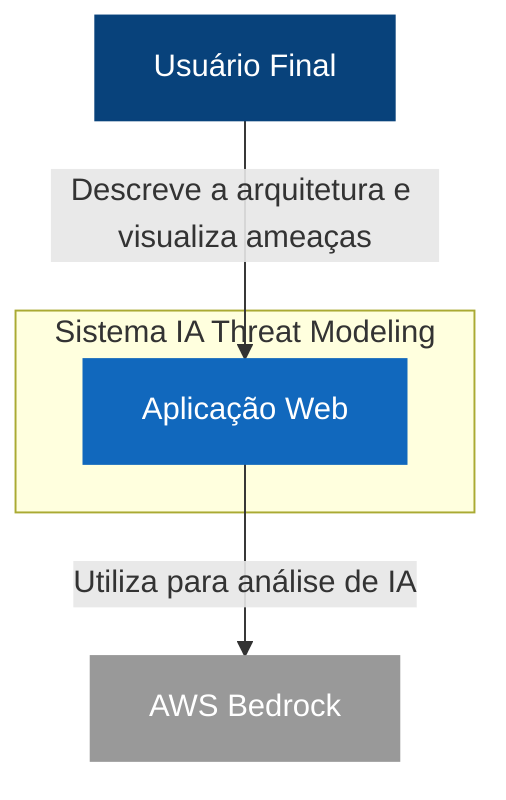
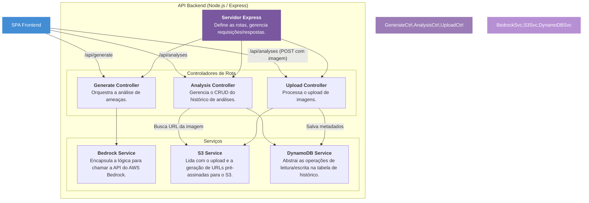

# IA Threat Modeling

Este projeto é uma aplicação web full-stack que utiliza Inteligência Artificial generativa para automatizar a análise de ameaças de segurança em arquiteturas de software. A aplicação permite que os usuários descrevam seus sistemas, opcionalmente façam upload de um diagrama, e recebam uma análise de ameaças detalhada baseada na metodologia STRIDE, gerada pelo modelo **Anthropic Claude 3 Sonnet** através do **AWS Bedrock**.

A aplicação é projetada para ser segura, escalável e implantada de forma automatizada na AWS usando uma arquitetura nativa da nuvem.

## Funcionalidades

- **Análise de Ameaças Automatizada:** Gera ameaças de segurança, descrições e mitigações com base em uma descrição da arquitetura.
- **Upload de Diagramas:** Permite o upload de imagens de diagramas de arquitetura para enriquecer o contexto da análise.
- **Histórico de Análises:** Armazena e exibe análises anteriores para referência futura.
- **Exportação de Relatórios:** Gera um relatório detalhado em PDF com os resultados da análise.
- **Implantação Contínua:** Pipeline de CI/CD automatizado com GitHub Actions e Terraform para implantação no AWS App Runner.

---

## Arquitetura

A aplicação é construída como um sistema web full-stack, seguro e nativo da nuvem. A arquitetura é dividida em componentes que lidam com o frontend, backend, IA, armazenamento e implantação.

### Diagramas C4

Para entender a arquitetura em diferentes níveis de detalhe, utilizamos o **Modelo C4**.

#### Nível 1: Diagrama de Contexto do Sistema

Este diagrama mostra a visão geral do sistema, seus usuários e suas interações com sistemas externos.



#### Nível 2: Diagrama de Contêineres

Este diagrama detalha a aplicação web em seus contêineres (componentes de alto nível) e como eles interagem.

```mermaid
graph TD
    User[Usuário Final] -- "Usa" --> SPA

    subgraph "Sistema IA Threat Modeling"
        direction LR
        SPA[<b>SPA (Single-Page App)</b><br><br>React / Vite<br>Interface do usuário para análise de ameaças.]
        API[<b>API Backend</b><br><br>Node.js / Express<br>Serve a SPA, gerencia a lógica de negócio e se comunica com a AWS.]
    end

    subgraph "Plataforma AWS"
        direction TB
        S3[<b>S3 Bucket</b><br><br>Armazena diagramas de arquitetura carregados.]
        DynamoDB[<b>DynamoDB</b><br><br>Armazena o histórico das análises.]
        Bedrock[<b>Bedrock</b><br><br>Fornece o modelo de IA (Claude 3) para a análise.]
    end

    SPA -- "Faz chamadas de API (HTTPS)" --> API
    API -- "Invoca o modelo de IA" --> Bedrock
    API -- "Armazena e busca imagens" --> S3
    API -- "Armazena e busca dados de análise" --> DynamoDB

    style User fill:#08427b,stroke:#08427b,color:#fff
    style SPA fill:#438dd5,stroke:#438dd5,color:#fff
    style API fill:#438dd5,stroke:#438dd5,color:#fff
    style S3 fill:#232f3e,stroke:#232f3e,color:#fff
    style DynamoDB fill:#232f3e,stroke:#232f3e,color:#fff
    style Bedrock fill:#232f3e,stroke:#232f3e,color:#fff
```

#### Nível 3: Diagrama de Componentes

Este diagrama foca nos componentes internos do contêiner da **API Backend**, mostrando como suas responsabilidades são divididas.



---

## Executando Localmente

Para executar a aplicação localmente, você precisará do Node.js e de credenciais da AWS configuradas em seu ambiente.

1.  **Clone o repositório:**
    ```bash
    git clone <URL_DO_REPOSITORIO>
    cd ia-threat-modeling
    ```

2.  **Instale as dependências:**
    ```bash
    npm install
    ```

3.  **Configure as variáveis de ambiente:**
    Crie um arquivo `.env` na raiz do projeto e adicione as seguintes variáveis. **Nota:** Estes são os nomes dos recursos que serão criados pelo Terraform. Para o desenvolvimento local, você pode criar esses recursos manualmente ou adaptar o código para usar emuladores locais como o DynamoDB Local.
    ```
    AWS_REGION=us-east-1
    DYNAMODB_TABLE_NAME=ia-threat-modeling-history
    S3_BUCKET_NAME=ia-threat-modeling-uploads-xxxxxxxx
    ```

4.  **Execute o servidor de desenvolvimento:**
    O Vite irá executar o frontend em um servidor de desenvolvimento e fará o proxy das chamadas de API para o backend.
    ```bash
    npm run dev
    ```

5.  **Execute o servidor backend:**
    Em um terminal separado, inicie o servidor Node.js.
    ```bash
    npm run start
    ```

A aplicação estará disponível em `http://localhost:5173`.

---

## Implantação (CI/CD)

A implantação é totalmente automatizada usando **Terraform** e **GitHub Actions**.

### Fluxo de Implantação

1.  **Push na Branch `main`:** Um push ou merge na branch `main` aciona o workflow do GitHub Actions definido em `.github/workflows/deploy.yml`.
2.  **Configuração do Ambiente:** O workflow configura as credenciais da AWS a partir dos secrets do repositório.
3.  **Terraform Init & Apply:** O workflow executa `terraform init` e `terraform apply` no diretório `terraform/`. O Terraform provisiona ou atualiza os recursos na AWS conforme definido nos arquivos `.tf` (App Runner, S3, DynamoDB, IAM Roles).
4.  **Implantação no App Runner:** O AWS App Runner é configurado para observar a branch `main`. Após o `terraform apply` ser concluído, o App Runner automaticamente puxa o código mais recente, constrói a imagem Docker a partir do `Dockerfile` e implanta a nova versão da aplicação sem tempo de inatividade.

### Pré-requisitos de Implantação

Antes da primeira implantação, você precisa configurar o seguinte:

1.  **Conexão AWS com o GitHub:** No console do AWS App Runner, crie uma conexão com seu repositório do GitHub.
2.  **Secrets do GitHub:** No seu repositório do GitHub, vá para `Settings > Secrets and variables > Actions` e crie os seguintes secrets:
    - `AWS_ACCESS_KEY_ID`: Sua chave de acesso da AWS.
    - `AWS_SECRET_ACCESS_KEY`: Sua chave secreta da AWS.
    - `GITHUB_CONNECTION_ARN`: O ARN da conexão criada no passo anterior.